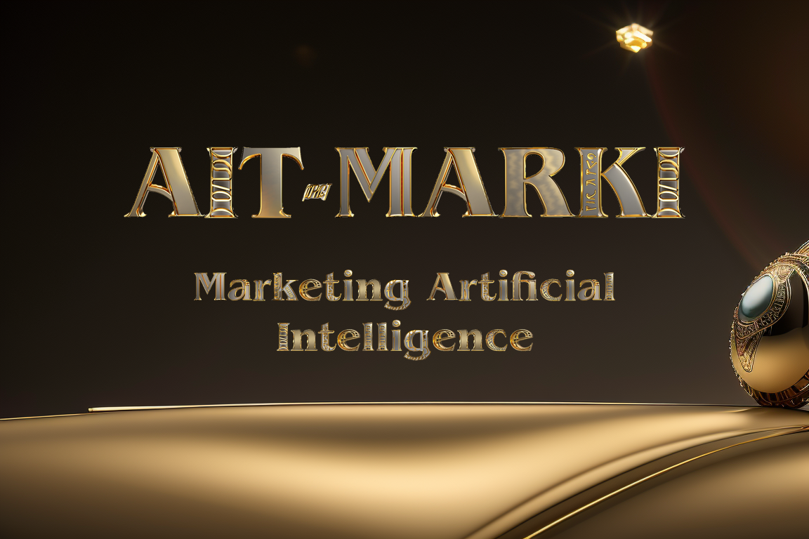

- [Inspiration](#inspiration)
    - [Entrepreneurial Voyage](#entrepreneurial-voyage)
    - [Challenging Conundrum](#challenging-conundrum)
    - [Data Revelation](#data-revelation)
    - [AIT-MARKI Genesis](#ait-marki-genesis)
    - [Beyond a Tool](#beyond-a-tool)
    - [Defying Norms](#defying-norms)
    - [Emergence of AIT-MARKI](#emergence-of-ait-marki)
- [What it Does](#what-it-does)
    - [Automated Image Analysis](#automated-image-analysis)
    - [Human-Centric Refinement](#human-centric-refinement)
    - [Semantic Narration](#semantic-narration)
    - [Emotionally Resonant Title Generation](#emotionally-resonant-title-generation)
    - [Unveiling Emotional Triggers](#unveiling-emotional-triggers)
    - [Crafting Emotional Appeal Messaging](#crafting-emotional-appeal-messaging)
    - [Seamless Integration with Square's Catalog API](#seamless-integration-with-squares-catalog-api)
- [How we built it](#how-we-built-it)
    - [Automated Image Analysis](#automated-image-analysis-1)
    - [Human-Centric Refinement](#human-centric-refinement-1)
    - [Semantic Narration](#semantic-narration-1)
    - [Emotionally Resonant Title Generation](#emotionally-resonant-title-generation-1)
    - [Unveiling Emotional Triggers](#unveiling-emotional-triggers-1)
    - [Crafting Emotional Appeal Messaging](#crafting-emotional-appeal-messaging-1)
    - [Seamless Integration with Square's Catalog API](#seamless-integration-with-squares-catalog-api-1)
- [Challenges we ran into](#challenges-we-ran-into)
    - [Refinement of AI Outputs](#refinement-of-ai-outputs)
    - [Backend Logic and Workflow Integration](#backend-logic-and-workflow-integration)
    - [System Performance Optimization](#system-performance-optimization)
    - [User Interface Development](#user-interface-development)
    - [Rigorous Testing and User Feedback Collection](#rigorous-testing-and-user-feedback-collection)
    - [Overcoming the Challenges](#overcoming-the-challenges)

- [Accomplishments that we're proud of](#accomplishments-that-were-proud-of)
    - [Engineering AI-centric Solution](#engineering-ai-centric-solution)
    - [Opening New E-commerce Era](#opening-new-e-commerce-era)
    - [Journey from Concept to Realization](#journey-from-concept-to-realization)

- [What we learned](#what-we-learned)
    - [Mastering Prompt Engineering](#mastering-prompt-engineering)
    - [Human-Centric Design Paradigm](#human-centric-design-paradigm)
    - [Orchestration of Cloud Services](#orchestration-of-cloud-services)
    - [Real-World Machine Learning Quandaries](#real-world-machine-learning-quandaries)
    - [Rapid Prototyping & User Feedback Loop](#rapid-prototyping--user-feedback-loop)
    - [Project Scoping & Prioritization](#project-scoping--prioritization)
    - [AI: A Double-Edged Sword](#ai-a-double-edged-sword)
    - [End-to-End AI Solution Creation](#end-to-end-ai-solution-creation)
- [What's next for AIT-MARKI](#whats-next-for-ait-marki)
    - [Deepening Synergy with Square](#deepening-synergy-with-square)
    - [Refined AI Customization](#refined-ai-customization)
    - [Multilingual Mastery](#multilingual-mastery)
    - [SEO Optimization Prowess](#seo-optimization-prowess)
    - [Tiered Access for Varied Needs](#tiered-access-for-varied-needs)
    - [Affiliate Marketing Endeavor](#affiliate-marketing-endeavor)
    - [Continual Evolution](#continual-evolution)

### Entrepreneurial Voyage

Embarking upon the entrepreneurial voyage within the realm of e-commerce presented a common yet elusive conundrum: encapsulating the essence of art images in words that resonate emotionally with potential buyers. The aesthetic allure of the art pieces was undeniable, but transmuting visual allure into evocative narratives proved to be a Herculean task.

### Challenging Conundrum

The challenge transcended the sheer volume of artworks requiring descriptive elucidation. It was about crafting a narrative capable of touching the heartstrings of patrons, evoking a deep-seated emotional resonance that goes beyond superficial allure. In the digital commerce labyrinth, where every click unveils a new horizon of visual enticements, standing out pivoted not merely on being seen, but being felt.

### Data Revelation

Data revealed that to amass a significant income of $60k, an artist would need to vend approximately 2,000 prints within a year, assuming a net income of $30 post the expenses of printing, framing, and shipping. This projection showcased a stark reality - selling art online transcended a game of numbers into a narrative of engagement. Traditional marketing methods hit a wall, unable to pierce through the digital anonymity veil, failing to evoke the artistry essence in words that reverberated with the audience's emotions.

### AIT-MARKI Genesis

Thus, the **AIT-MARKI** seed was sown - envisioned as a compass navigating through the confluence of artistry and commerce. A platform designed to perceive, not merely see, delving beyond the surface into the emotional and aesthetic heart of every art piece. The marriage between Google's Imagen on Vertex AI and the artistry-centric narrative of **AIT-MARKI** emerged from a well-orchestrated endeavor to bridge the visual with the verbal, the seen with the felt.

### Beyond a Tool

**AIT-MARKI**, an acronym for Marketing Artificial Intelligence, was conceptualized to be more than just a tool; it aimed to be a companion for artists and merchants. A companion adept at understanding, interpreting, and narrating the visual narrative in a language resonating with potential patrons' hearts. The meticulous 7-step process stands as a testament to the harmonious symphony between machine learning and human intuition, each step crafted to ensure that the essence of every artwork is amplified, not lost, in the transition from the visual to the verbal realm.

### Defying Norms

This journey also epitomized defying the norm, venturing beyond the beaten path. While other platforms provided automated descriptions, **AIT-MARKI** took a leap further by embedding a rich layer of emotional resonance within every narrative it spun. It transcended what the eyes see to what the heart feels. The integration of emotional appeal messaging, emotion-focused buying reasons, and handcrafted titles and descriptions was a deliberate stride towards crafting a narrative that does more than just describe; it evokes, it resonates, it engages.

### Emergence of AIT-MARKI

In a world awash with automated responses and sterile descriptions, **AIT-MARKI** emerges as a breath of fresh air, presenting a narrative imbued with emotional resonance. A narrative that captures not just the artwork's essence but narrates the unspoken, the felt, the profound. It aims to rekindle the intimate bond between the creator and the beholder, narrating a story that transcends the digital divide, whispering the silent notes of creativity into the hearts of those daring to listen.

## What it Does

**AIT-MARKI** serves as a pioneering bridge between the realms of artistic creation and e-commerce marketing, embodying a blend of technological sophistication and human intuition. Here's a breakdown of its functionalities:

### Automated Image Analysis
Upon uploading an image, **AIT-MARKI**  kicks into gear, performing a thorough analysis to identify key visual elements. This includes extracting relevant keywords and discerning the color palette, forming a foundational understanding of the artwork's visual essence.

### Human-Centric Refinement
At this juncture, the human creator steps in, augmenting the AI-generated insights with their contextual understanding through the 'Image Insight' and 'Keywords' fields. This symbiotic interaction enriches the data, adding layers of nuance and depth.

### Semantic Narration
Leveraging the amalgam of AI-derived and human-supplemented data, **AIT-MARKI**  crafts a coherent narrative that encapsulates the artwork's essence. This narrative serves as a baseline that can be further refined to resonate with the brand's unique voice.

### Emotionally Resonant Title Generation
Building upon the narrative, an evocative title is generated, summarizing the artwork's core message. This title is not set in stone but can be tailored to better align with the intended emotional impact.

### Unveiling Emotional Triggers
AIT-MARKI delves into the emotional sphere, generating a list of emotion-focused buying reasons. This step is crucial in forging a deeper connection with potential buyers, evoking a sense of desire and engagement.

### Crafting Emotional Appeal Messaging
Expanding on the identified emotional triggers, **AIT-MARKI** concocts messaging that touches the hearts of the audience, weaving a narrative that's not only persuasive but emotionally resonant.

### Seamless Integration with Square's Catalog API
In the final stride, the meticulously crafted content, along with the image and associated data, is seamlessly transmitted to Square's e-commerce platform through a simple click. This integration ensures that the shop-ready listings are instantly updated or created on Square's platform, closing the loop of the process.

At its core, **AIT-MARKI** is engineered to liberate artists and merchants from the time-intensive chore of manual product listing creation, without compromising on the emotional richness and authenticity of the narrative. Through a harmonious blend of AI and human creativity, **AIT-MARKI**  not only simplifies the marketing process but elevates it, fostering a more profound and emotionally engaging connection between the creator, the artwork, and the potential buyer. It's about transcending the mundane and venturing into a realm where marketing becomes a narrative art, and every product listing tells a story that resonates deeply with the human heart.

## How we built it

**AIT-MARKI** serves as a pioneering bridge between the realms of artistic creation and e-commerce marketing, embodying a blend of technological sophistication and human intuition. Here's a breakdown of its functionalities:

### Automated Image Analysis
Upon uploading an image, **AIT-MARKI** kicks into gear, performing a thorough analysis to identify key visual elements. This includes extracting relevant keywords and discerning the color palette, forming a foundational understanding of the artwork's visual essence.

### Human-Centric Refinement
At this juncture, the human creator steps in, augmenting the AI-generated insights with their contextual understanding through the 'Image Insight' and 'Keywords' fields. This symbiotic interaction enriches the data, adding layers of nuance and depth.

### Semantic Narration
Leveraging the amalgam of AI-derived and human-supplemented data, **AIT-MARKI** crafts a coherent narrative that encapsulates the artwork's essence. This narrative serves as a baseline that can be further refined to resonate with the brand's unique voice.

### Emotionally Resonant Title Generation
Building upon the narrative, an evocative title is generated, summarizing the artwork's core message. This title is not set in stone but can be tailored to better align with the intended emotional impact.

### Unveiling Emotional Triggers
AIT-MARKI delves into the emotional sphere, generating a list of emotion-focused buying reasons. This step is crucial in forging a deeper connection with potential buyers, evoking a sense of desire and engagement.

### Crafting Emotional Appeal Messaging
Expanding on the identified emotional triggers, **AIT-MARKI** concocts messaging that touches the hearts of the audience, weaving a narrative that's not only persuasive but emotionally resonant.

### Seamless Integration with Square's Catalog API
In the final stride, the meticulously crafted content, along with the image and associated data, is seamlessly transmitted to Square's e-commerce platform through a simple click. This integration ensures that the shop-ready listings are instantly updated or created on Square's platform, closing the loop of the process.

At its core, **AIT-MARKI** is engineered to liberate artists and merchants from the time-intensive chore of manual product listing creation, without compromising on the emotional richness and authenticity of the narrative. Through a harmonious blend of AI and human creativity, **AIT-MARKI** not only simplifies the marketing process but elevates it, fostering a more profound and emotionally engaging connection between the creator, the artwork, and the potential buyer. It's about transcending the mundane and venturing into a realm where marketing becomes a narrative art, and every product listing tells a story that resonates deeply with the human heart.

## Challenges we ran into

The journey of constructing an intricate end-to-end AI automation platform like  **AIT-MARKI** was laden with technical challenges that demanded iterative refinement and a robust troubleshooting approach. Below are the key challenges and the strategies employed to navigate through them:

### Refinement of AI Outputs:
The iterative refinement of the PaLM 2 prompts to generate high-quality titles and descriptions tailored to each product was a demanding task. Achieving the right phrasing and examples entailed substantial experimentation, showcasing the dynamic nature of melding AI with creative marketing needs.

### Backend Logic and Workflow Integration:
Engineering the backend logic and orchestrating workflows to harmoniously integrate PaLM 2 with the Google Sheets UI and Square API was a complex endeavor. It required a meticulous design approach to ensure smooth data flow and interactions between these disparate systems.

### System Performance Optimization:
Post deployment, optimizing  **AIT-MARKI** to perform efficiently at scale presented challenges around memory limitations, timeouts, and propagation delays. A thorough analysis and tweaking of system parameters were essential to enhance performance and ensure reliability.

### User Interface Development:
Crafting an intuitive user interface that strikes a balance between automation and merchant customization was a nuanced challenge. It was imperative to provide a platform where merchants felt in control while still enjoying the benefits of intelligent automation.

### Rigorous Testing and User Feedback Collection:
A robust testing framework and an open channel for collecting user feedback were instrumental in improving the workflow, UI, and PaLM 2 outputs based on real-world usage. This iterative feedback loop was vital in refining  **AIT-MARKI** to better meet the users' needs.

### Overcoming the Challenges:
Through extensive iteration, troubleshooting, and a proactive approach towards collecting and acting on user feedback, we were able to surmount these challenges. The process led to the evolution of a robust platform that delights users with its ease-of-use, intelligent automation, and the empowerment it offers to merchants in crafting compelling product narratives. This journey underscored the value of a user-centric design ethos and a commitment to continuous improvement, hallmarks that now define the essence of  **AIT-MARKI**.

## Accomplishments that we're proud of

We take immense pride in having engineered an AI-centric solution that addresses a significant hurdle for merchants in a user-friendly manner. The ability to metamorphose product images into sales-centric copy with a mere click is a milestone that exhilarates us.

### Engineering AI-centric Solution
**AIT-MARKI** not only simplifies the content creation process but also opens a gateway to a new era of e-commerce marketing where the visual allure of products is seamlessly translated into compelling narratives that resonate with customers. The blend of simplicity, efficiency, and innovation encapsulated in **AIT-MARKI** showcases our commitment to empowering merchants with smart technology that's easy to use and adds tangible value to their business operations.

### Opening New E-commerce Era
As we revel in this accomplishment, our excitement is fueled further by the vast horizon of possibilities that **AIT-MARKI** unveils. The journey from concept to realization has been profoundly enlightening, and the positive feedback propels us to continue refining and expanding the capabilities of **AIT-MARKI**.

### Journey from Concept to Realization
We envision **AIT-MARKI** evolving as an indispensable tool in the e-commerce landscape, continually adapting to the dynamic market needs and setting new benchmarks in automated, emotionally-engaging marketing. The future beckons with promises of further innovation, and we are passionately poised to explore the unfolding potential of AI in transforming the marketing narrative.

## What we learned

The journey of constructing **AIT-MARKI** has been a cornucopia of learning and enlightenment, unraveling both the prowess and the intricacies associated with AI-driven solutions:

### Mastering Prompt Engineering
The quintessence of high-quality AI outputs resonated through the arduous but rewarding process of prompt engineering. The iterative refinement of prompts and examples emerged as a linchpin in harnessing the desired AI behavior.

### Human-Centric Design Paradigm
A profound appreciation for a design ethos that harmonizes automation with user control was cultivated. This balance not only enriched user engagement but significantly enhanced the output quality, reinstating the virtue of customization in automated realms.

### Orchestration of Cloud Services
Melding multiple cloud services into a unified workflow transcended the bounds of individual technologies, each playing a pivotal role in sculpting a robust, seamless user experience.

### Real-World Machine Learning Quandaries
The expedition into the real-world application exposed us to quintessential machine learning challenges like overfitting, instilling a pragmatic understanding and hands-on experience in navigating such hurdles.

### Rapid Prototyping & User Feedback Loop
The benefaction of early user feedback through rapid prototyping was palpable. It served as a catalyst for iterative improvements, aligning the development trajectory with user expectations and market needs.

### Project Scoping & Prioritization
A pragmatic approach in scoping machine learning projects and prioritizing pivotal features was gleaned. This discernment helped in astutely allocating resources and time to elements with the highest impact.

### AI: A Double-Edged Sword
The dexterity of AI in automating complex tasks like crafting emotional product copy was awe-inspiring, yet, a cognizance of its limitations was equally illuminating. This understanding breeds a balanced perspective that will be instrumental in our future AI endeavors.

### End-to-End AI Solution Creation
The entirety of this venture has bestowed upon us invaluable experience in conceiving, developing, and refining an end-to-end AI solution. The lessons imbibed are quintessential assets that will guide our odyssey in developing impactful and ethical AI products.

This repertoire of learnings is not merely a reflection of our past endeavor but a beacon that illuminates the path towards our future ventures in the captivating realm of AI.

## What's next for AIT-MARKI

The voyage of **AIT-MARKI** is poised towards a horizon filled with innovation and enhanced utility. Here's a glimpse into the exciting roadmap that lies ahead:

### Deepening Synergy with Square
We aim to augment our integration with Square, meticulously crafting atop their e-commerce APIs to foster a seamless, intuitive experience for merchants. This symbiotic relationship is envisioned to unlock new realms of operational efficiency and user satisfaction.

### Refined AI Customization
A pivotal focus is to enhance the AI’s acumen in tailoring outputs based on a myriad of attributes such as product category, brand voice, and other pivotal parameters. This nuanced customization is the cornerstone of delivering resonant, high-impact content that echoes the unique essence of each brand.

### Multilingual Mastery
Embarking on a mission to transcend language barriers, we aspire to incorporate additional languages, catering to the diverse linguistic tapestry of international merchants. This expansion is a stride towards making AIT-MARKI a global companion in e-commerce storytelling.

### SEO Optimization Prowess
Exploring the intricacies of SEO, we aim to further refine the titles and descriptions generated, ensuring they are not only emotionally compelling but also SEO-resonant. This dual focus is anticipated to significantly amplify online visibility and traffic for our users.

### Tiered Access for Varied Needs
Our objective is to curate a spectrum of tiered plans that accommodate the diverse needs and scales of various merchants. This inclusivity is a step towards democratizing access to AI-powered marketing brilliance.

### Affiliate Marketing Endeavor
The launch of an affiliate marketing program is on the anvil to spur organic growth and foster a community of advocates. This strategy is geared towards creating a ripple effect of awareness and adoption.

### Continual Evolution
The current iteration of AIT-MARKI is a testament to our commitment to providing value. Yet, the vista of potential that lies ahead is exhilarating. With every stride, we aim to evolve AIT-MARKI into an indispensable, global AI assistant that stands as a paragon of excellence in e-commerce marketing automation.

The trajectory of AIT-MARKI is meticulously aligned with the vision of catalyzing a transformative impact in the e-commerce arena. Each planned enhancement is a stepping stone towards creating a vortex of value for merchants, heralding a bright, promising future where AI-driven marketing is not just a tool but an extension of the merchant's creative vision.

